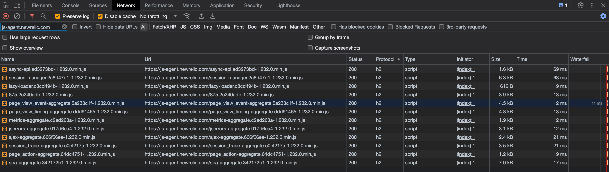
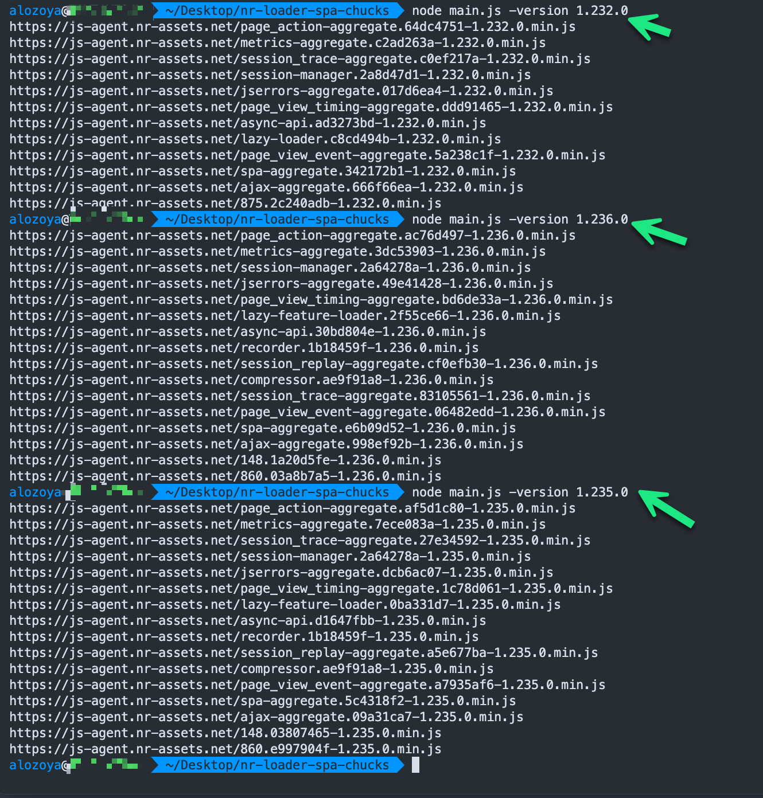

[](https://opensource.newrelic.com/oss-category/#new-relic-experimental)

# [nr-loader-spa-chuck-gen]
> The nr-loader-spa-chuck-gen repository was created to enable organizations to easily streamline the collection of dynamic chucksIds allowing for a more efficient gathering of version-specific chunksIds i.e. `<filename>.<chunkId>-<version>.min.js`. These chunks are asynchronously loaded based on their IDs within the agent. 
>
>
>
> Upon downloading the chunks, organizations can utilize these chunks to enable the loading of chunks as first-party resources, bypassing ad-blockers, or through their own content delivery networks (CDNs).

## Installation

```console
 npm install
```

## Getting Started

```console
 npm main.js -version 1.236.0
```

## Getting your browser PRO+SPA agent version

There are different agent types. This script is configured specifically for the SPA agent loader file which the format `js-agent.newrelic.com/nr-loader-spa-<version>.js`. To verify your copy/pasted version of the browser script loader on your page, inspect the newrelic global object (v1224 or higher):

- Open the developer tools of your browser.
- Open the console view.
- In the console, enter `newrelic.initializedAgents`.
- In the resulting object, expand the relevant agent object.
- Inside the relevant agent object, find `runtime.loaderType` and `runtime.version`.

 Example usage:

 

## Contributing

We encourage your contributions to improve [project name]! Keep in mind when you submit your pull request, you'll need to sign the CLA via the click-through using CLA-Assistant. You only have to sign the CLA one time per project.
If you have any questions, or to execute our corporate CLA, required if your contribution is on behalf of a company, please drop us an email at opensource@newrelic.com.

### **A note about vulnerabilities**

As noted in our [security policy](../../security/policy), New Relic is committed to the privacy and security of our customers and their data. We believe that providing coordinated disclosure by security researchers and engaging with the security community are important means to achieve our security goals.

If you believe you have found a security vulnerability in this project or any of New Relic's products or websites, we welcome and greatly appreciate you reporting it to New Relic through [HackerOne](https://hackerone.com/newrelic).

## License

[nr-loader-spa-chuck-gen] is licensed under the [Apache 2.0](http://apache.org/licenses/LICENSE-2.0.txt) License.

> [If applicable: The [nr-loader-spa-chuck-gen] also uses source code from third-party libraries. You can find full details on which libraries are used and the terms under which they are licensed in the third-party notices document.]
